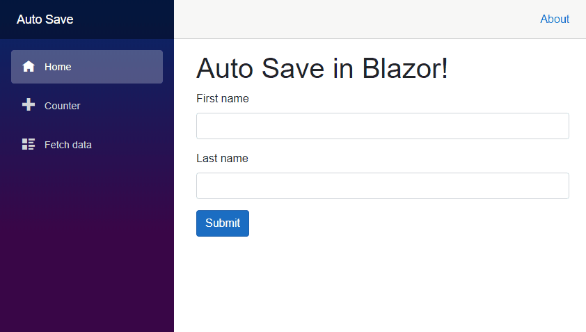

# Blazored AutoSaveEditForm

A replacement for the default EditForm component which will auto save a form until it is successfully submitted.

## Currently in development
This project is currently in development and hasn't been released yet. If you would like to help or have any suggestions for features please raise an issue.

